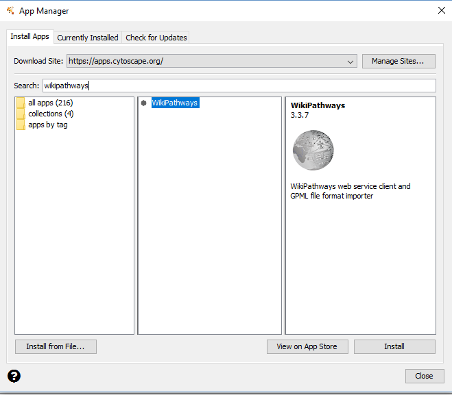
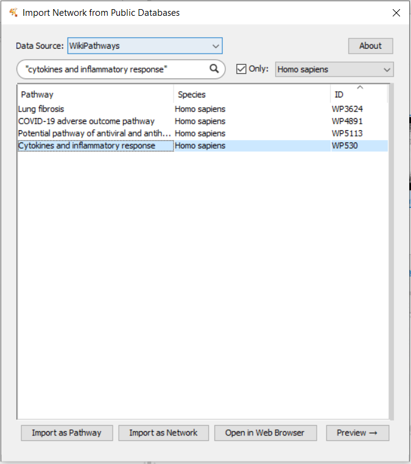
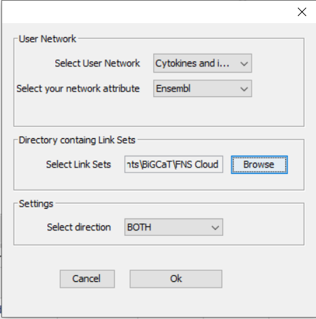
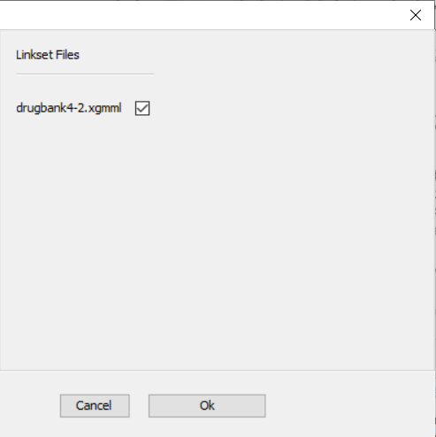
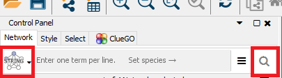
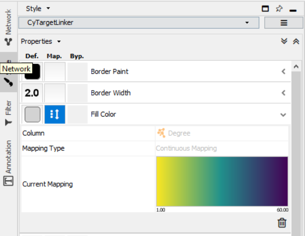
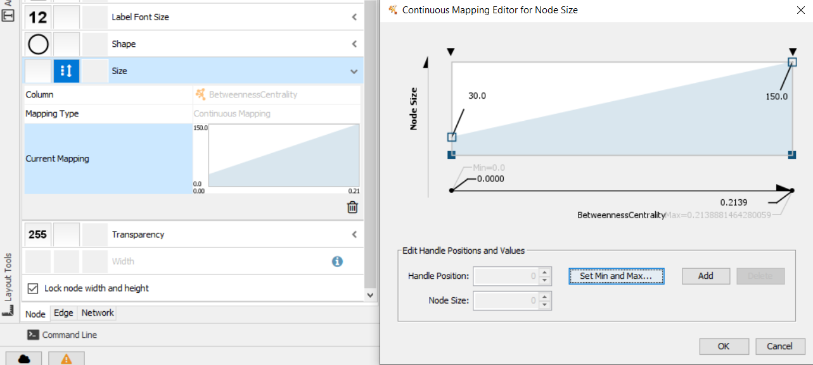

# Network Analysis
## Using network analysis to study the molecular and regulatory mechanisms involved in inflammatory bowel syndrome

Practical prepared by: Dr. Martina Summer-Kutmon and Dr. Lauren Dupuis
 
In this tutorial, we want to show you different ways you can build a biological network relevant for a biological research topic. 

### Task 1: Drug targets in the cytokines and inflammatory response pathway

Using the cytokines and inflammatory response pathway, you will learn how pathways can be used as a resource for network biology. Besides looking at the network structure, we will also add drug-target information to see which drugs in the DrugBank database are known to target genes in the cell cycle pathway.
Before beginning, make sure the WikiPathways App is installed. Click “Apps” - “App Manager”. Search for WikiPathways and click “Install”. 
Do the same for “stringApp”.

 
 

 
 

Now we can begin by importing the cytokine and inflammatory response pathway as a network.
 
•	Go to “File - Import - Network From Public Databases”
 
•	A dialog box will appear. Change the Data Source dropdown box to “WikiPathways”. Search for “cytokines and inflammatory response”. Click the check box for “Only:”, and choose “Homo sapiens” in the dropdown box. 
 
•	Select “cytokine and inflammatory response” from the list and click “Import as Network”

 
 

 
 

> **Question 1.1**: How many nodes and edges are in the network?	

> **Question 1.2**: Are all of the nodes connected? Are there any subnetworks? 

Now we are going to investigate which drugs are known to target the proteins in this pathway.
You can download the Drugbank linkset to extend the network with from [here](https://ndownloader.figshare.com/files/21623682?private_link=32aae0822ffdd1f5660b). If you want to download other linksets, you can find them [here](https://cytargetlinker.github.io/pages/linksets.html).
Download and unzip the linkset.
 
•	Go to “Apps → CyTargetLinker → Extend network”
 
•	Fill in the following settings: 

 
 

 
 

**Choose only the file that contains the linkset.** When you click OK a dialog box appears where you can check which linkset you want to add.

 
 

 
 

•	Now the known drugs from DrugBank have been added – information about drug name, drug category or approval status can be found in the node table.
 
•	If you go to “Apps → CyTargetLinker → Show Result Panel”, you can see how many drugs were added (on the right side of the screen). You can find more information about the drugs on the [DrugBank website](http://www.drugbank.ca/) to investigate if any of the drugs are used for lung cancer treatment.  The identifiers and names of the drugs can be found in the node table below the network. 
 
> **Question 1.3**: Are there any genes that are targeted by many drugs?

 
**You can also try this step with microRNAs by choosing the** [linkset you wish to use](https://cytargetlinker.github.io/pages/linksets.html). **If you have data for microRNAs, you can also visualize it on these nodes.** 

### Task 2: Build network for up-regulated inflammatory bowel disease genes

 

**Step 1: Gene selection**
•	Open the dataset (table_CD_Ileum_vs_nonIBD_Ileum_host_transcriptomics_metabolomics.txt) in Excel. 
 
•	Select the significantly up-regulated genes with a log2FC > 1 → filter the table by log2FC (>1) and the P.Value (< 0.05). 
 
•	Copy the Ensembl IDs of the 756 genes.

 

**Step 2: Create PPI network for gene selection**

 

•	In Cytoscape, go to the Control Panel and select the STRING protein query (drop-down box left to search field) and paste the 756 gene names in the query field 

 
 

 
 

•	Click on the search icon.

> **Question 2.1**: How many nodes and edges are in the resulting network?	
 
 Notice that not all nodes are connected.
 
•	Select the largest connected subnetwork (click shift and select the area of the subnetwork with the computer mouse). Go to File - New Network - From selected nodes, all edges.
 
•	A new network will be created only containing the largest connected subnetwork with 413 nodes and 3812 edges.
**Question 2.2**: Make a screenshot of the network

 

**Step 3: Investigate the network properties of the network**

 

•	Go to “Tools → Analyze Network”
 
o	The network should be treated as an undirected network (protein-protein interactions, in general, do not have a direction)
 
•	This tool will calculate all network properties like degree and betweenness for you.
 

> **Question 2.3**: Look at the “Node degree Distribution” and “Betweenness by Degree” tab in Results panel of the Network Analyzer. How are node degree and betweenness distributed in this network? Do the distributions make sense? Are there any interesting observations?
Note that you can click the box on the plot titled "Interactive". This allows you to select specific points to view in the node table.

 

**Step 4: Create visualization to show degree and betweenness centrality**

 

•	On the left side, choose the "Style" tab. Here you can create a visualization to show the data you wish to see in a more intuitive manner. It is best to first switch the style from String to another such as the Default or CyTargetLinker. 
 
You can begin with representing the degree of a node with "Fill Color". Scroll to fill color, and click the "Map" box on the left. Next to "Mapping Type", choose "Continuous Mapping" so you will have a color gradient. Next to "Column", choose "Degree" as shown below. Note that you can change the colors and values by double clicking on the "Current Mapping" of colors that's shown.

 
 

 
 

You can also visualize the Betweenness Centrality of nodes by changing the size. Select the "Continuous Mapping" for the Mapping Type and the "BetweennessCentrality" for the Column. It will be simplest to visualize if you change the default mapping given by the program to give a larger spread in the size of the nodes. Do this by double clicking on the Current Mapping and changing the value on the right to a higher number (in the figure I have taken 150). 

 
 

 
 

Take a look at the overall network visualization. Large nodes have a high betweenness and the darker the node, the higher the degree.
> **Question 2.4**: Columns in Cytoscape are sortable by clicking on the header. Do you see any hub nodes? Which node has the highest degree?

 

**Step 5: Find more information about major hub gene**

 

There is one gene attracting attention due to a very high degree and betweenness. The human protein atlas is an exceptional resource to find out more information about the expression of a gene/protein in different tissues but it also provides detailed pathology analysis for relevant genes. 
•	Go to the [protein atlas](https://www.proteinatlas.org/) 
•	Search for IL6 - hub gene of our previous network
•	In the pathology tab, you can find information about the prognostic summary for different cancers, the RNA expression overview using data from IL6, and show staining of the protein in different samples. 

