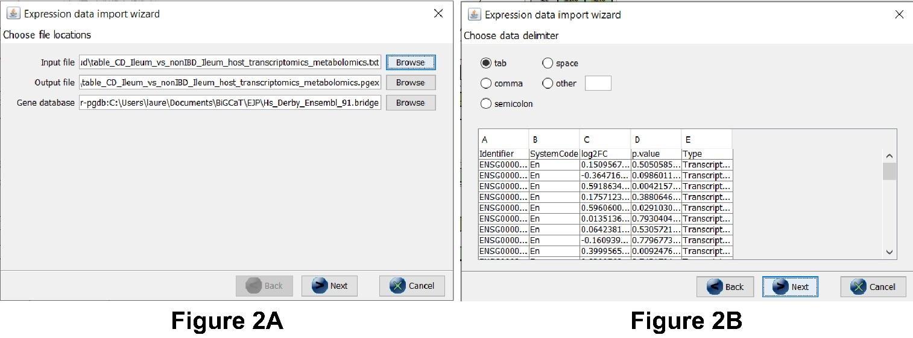
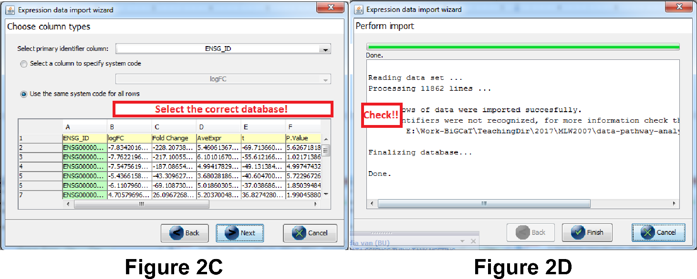
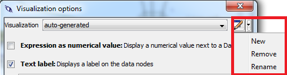
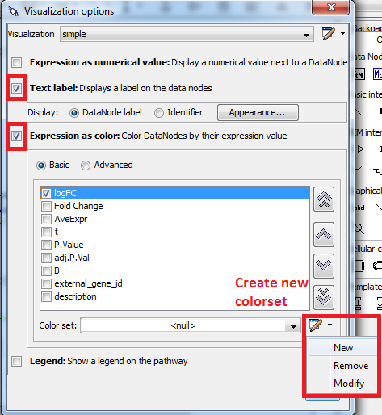
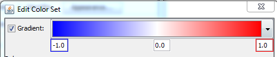
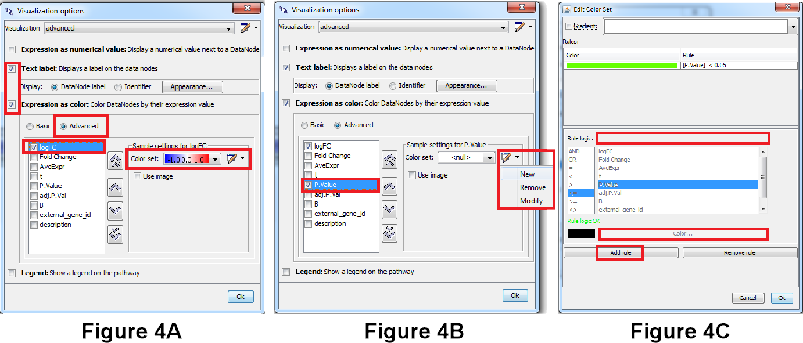

# Pathway Analysis Practical

Practical prepared by Dr. Martina Summer-Kutmon, Dr. Lauren J. Dupuis and Dr. Duygu Dede Sener
-----------------------------------------------------------------------------------------------------------------------------------------
Pathway analysis helps you to interpret the data in a biologically meaningful context. We will use the data from the Inflammatory Bowel Disease Multi Omics [Database](https://ibdmdb.org/). You will need the WikiPathways human pathways collection that you can download [here](http://www.wikipathways.org/wpi/batchDownload.php?species=Homo%20sapiens&fileType=gpml&tag=Curation:AnalysisCollection) as a zip file. You will need to unzip it before use. You will also need the BridgeDb identifier mapping file for humans which you can download [here](https://bridgedb.github.io/data/gene_database/).
For this task, you will need the data file table_CD_Ileum_vs_nonIBD_Ileum_host_transcriptomics_metabolomics.txt

## Task 1: Open a Pathway in PathVisio
-----------------------------------------------------------------------------------------------------------------------------------------

Begin by starting PathVisio. Open the Cell Cycle pathway from the WikiPathways collection you downloaded.

 

* Go to File → Open → Browse → Go to the folder with the Human pathways 

 

* Select Hs_Cytokines_and_Inflammatory_Response_WP530_111164.gpml

 

Small numbers above data nodes, interactions or the info box in the top left of the pathway indicate publication references. 

 

Double click the info box in the top left (Title, Availability, Last modified, Organism) and go to the “Literature” tab. 

 

> **Question 1.1** Is there a paper reference for this pathway?
>  
> 
> **Question 1.2** Click on the TGFB1 gene in the top left. Check the “Backpage” tab on the right side. Which identifier and database is the gene is annotated with? 

 

**Load the identifier mapping database:**
1.	Go to Menu Data → Select Gene Database → Browse to Hs_Derby_Ensembl_91.bridge in the Data folder
2.	Check the status bar at the bottom to see if the gene database has been loaded correctly. 

 

> **Question 1.3** Click on the TGFB1 gene again and go to the “Backpage” tab. Can you find other identifier(s) for this gene?  

 

## Task 2: Data Import in PathVisio
-----------------------------------------------------------------------------------------------------------------------------------------

Open the statistical analyzed data in Excel (table_CD_Ileum_vs_nonIBD_Ileum_host_transcriptomics_metabolomics.txt). The first column contains the identifier of the genes (ENSG_ID). 

 

> **Question 2.1** From which of the three database below are the identifiers in the dataset? (Required for following steps!)
 - [ ]    Ensembl
 - [ ]    Entrez Gene
 - [ ]    OMIM

 
Import the data as described below. Go through the different dialogs. 
Steps data import:
 

1.	Menu “Data” → Import expression Data
2.	Select the lung cancer dataset (table_CD_Ileum_vs_nonIBD_Ileum_host_transcriptomics_metabolomics.txt) as the input file. 
Everything else should be filled in automatically (see Figure 2a).
3.	In the next dialog, make sure the correct separators are used. You should see the different columns in the preview (see Figure 2b).

 
 

 
 

4.	Important: in the next step you need to select the column that contains the gene identifier and the database (system code) for the identifier. Select the database you chose in question 2A (Note: if the database is wrong your identifiers will not be recognized correctly), see Figure 2c. 
5.	Now the data is imported (see Figure 2d). **Before clicking “Finish”** answer the questions below:

 
 

 
 

> **Question 2.2** How many rows were successfully imported?

 

> **Question 2.3** How many identifiers were not recognized?  

 

**Important**: if the number of rows is the same as the number of identifiers not recognized the data import was not done correctly - you probably didn’t select the correct database (step 4 data import)! Redo the import or ask one of the instructors for help. **(Required for following steps!)**

 

**Check before you continue!**
If you clicked finish, you should see a default visualization on the pathway (if all genes are gray, the data import was not successful → please redo the import, make sure you select the correct database in step 4, otherwise ask one of the instructors). 
 
Click on the TGFB1 gene and check the “Data” tab on the right side → do you see the expression data?

 

> **Question 2.4** Take a screenshot of the pathway.
-----------------------------------------------------------------------------------------------------------------------------------
## Task 3: Creating a Basic Visualization
Follow the instruction to create a basic visualization:
 
1.	Go to Data → Visualization Options
2.	Create a new visualization named “basic visualization”

 
 

 
 

3.	Select “Expression as color” and “Text label”. 
4.	In “Expression as color” select “Basic”.
5.	Check the checkbox before “logFC” and define a new color set.

 
 

 
 

6.	Select “Gradient” and define a gradient from -1 over 0 to 1 (blue - white - red) → Click OK.

 
 

 
 

> **Question 3.1** What do the colors in the pathway mean biologically* (Hint: Check the “Legend” tab on the right side). 

 

> **Question 3.2** Select the IL6 gene (top left), go to the “Data” tab. What is the logFC of the IL6 gene?

 

## Task 4: Create and Advanced Visualization
PathVisio also allows users to visualize multiple data columns together. For that we need to create a new advanced visualization.

1.	Go to Data → Visualization Options
2.	Create a new visualization named “advanced visualization”
3.	Select “Expression as color” and “Text label”. 
4.	In “Expression as color” select “Advanced”.
5.	Check the checkbox before “LogFC” and define a new color set, see Figure 4A.
6.	Select “Gradient” and define a gradient from -1 to 0 to 1 (blue - white - red) → Click OK (same as in simple visualization).
7.	Check the checkbox before “P.Value” and define a new color set, see Figure 4B.
8.	At the bottom, click on “Add Rule”. Go to the text field next to “Rule Logic” and specify the following criteria: [P.Value] < 0.05. Then click on color and select a light green. Click OK and OK, see Figure 4C. 

 
 

 
 

> **Question 4.1** What do the colors in the different columns on the data nodes in the pathway mean biologically? Check the “Legend” tab on the right side. 
>  
> 
> **Question 4.2** Make a screenshot of the pathway with the visualization.

 

## Task 5: Perform Pathway Statistics

To identify pathways that might be affected by lung cancer, you can perform pathway statistics to calculate Z-Scores for each pathway. PathVisio automatically ranks the pathways based on the Z-Score. 

 

1.	Go to Menu Data → Statistics
2.	First we need to define a criteria for differentially expressed genes. We are going to select those genes based on significant p-value but we are also going to make sure the change is high enough by specifying a logFC threshold:
    a.	([logFC] < -1 OR [logFC] > 1) AND [P.Value] < 0.05

 

> **Question 5.1** What does this expression criteria mean (which genes will be selected)?
([logFC] < -1 OR [logFC] > 1) AND [P.Value] < 0.05

 

3.	Now we need to specify the pathway directory. Find the directory: 
Wikipathways-Human-Pathways. If you need to download the human pathway collection, you can do so [here](http://data.wikipathways.org/20210110/gpml/wikipathways-20210110-gpml-Homo_sapiens.zip).
4.	Browse to this directory and select it. 
5.	Then click on Calculate and wait for the result table.

 

> **Question 5.2** Observe the top altered pathways and their Z-Scores. Do you see highly ranked pathways in the result table that you expect to be affected by lung cancer?

 

> **Question 5.3** How many genes of the dataset are in at least one pathway (N) and how many differentially expressed genes of the dataset are present in at least one pathway (R)? (Check “N and R" above the result table)

 

> **Question 5.4** What is the pathway with the lowest Z-Score? What does a low Z-Score mean biologically? (ignore pathways with NaN)

